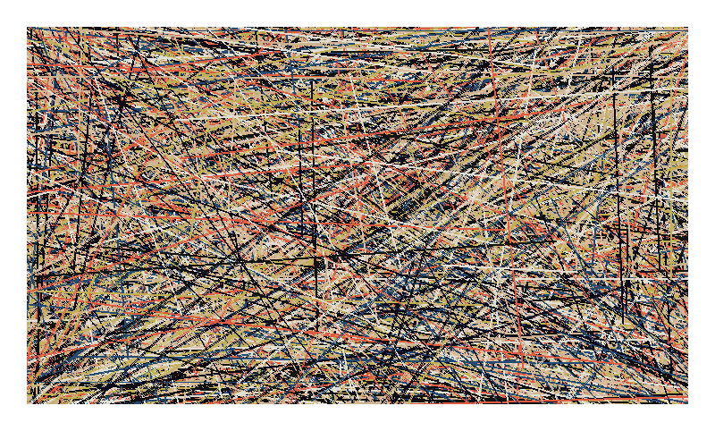

# digital-jackson-pollack
## Generate digital pixel splatters with Python and Pixku

## 

### Currently, this repo requires the installation and usage of my friends at Muvik Labs' [Pixku](https://www.github.com/MuvikLabs/pixku), which is built on their [Runt](https://github.com/MuvikLabs/runt) language.  

### In the near future, I will be rewriting everything to use Python's [Pillow](https://python-pillow.org) library.  This will eliminate the need to install and run Pixku, and will allow you to create images that larger than 256 x 256 pixels and contain more than 8 unique colors.

### I chose to imitate Jackon Pollack's 1952 *Convergence* because I like the colors, seemed like a good place to start.
